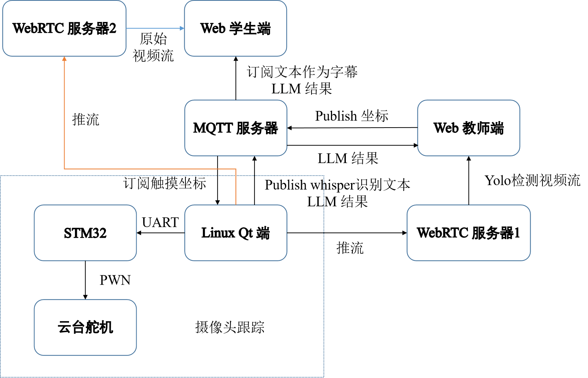
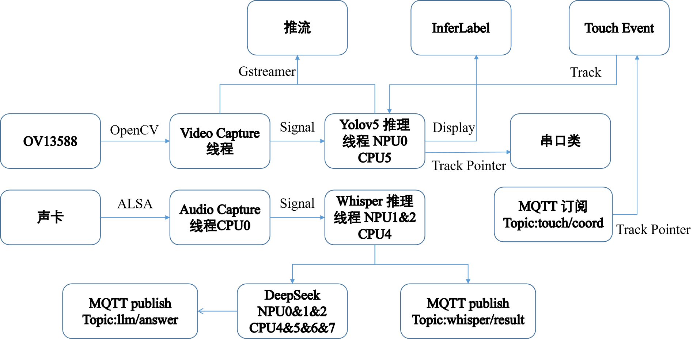

[介绍视频](./介绍视频.mp4)|[技术文档](./技术文档.pdf)

# 一、环境

Web前端：Vue 3.0

WebRTC 服务器： MediaMTX

MQTT 服务器：Mosquitto

上位机：RK3588 Buildroot 系统

下位机：STM32F103

# 二、安装

## 1. 动态库

将 install 文件夹放在根目录即可。

相关动态库下载链接: https://pan.baidu.com/s/14nZrK5h4cJ-4ys1xwD83iA?pwd=j9pu 提取码: j9pu

## 2. 模型

将 model 文件夹放入根目录即可。
模型链接: https://pan.baidu.com/s/12ybeVn-nkKm0xzOX1e7Uew?pwd=ub4y 提取码: ub4y

# 三、架构

## 1. 整体架构

## 2. Linux Qt 端架构

# 三、实现功能

## 1. Web 端

- 学生端：能够显示摄像头的视频，并显示字幕
  - 通过接收原始视频流
  - 通过订阅Whisper识别的文本作为字幕
- 教师端：能够显示YOLO检测视频流，且可以通过触摸检测框进行人体跟踪
  - 通过接收推流视频流
  - 通过发布坐标给 Linux 端，进行触摸事件的处理。

[项目测试手册](./application/README.md)

## 2. Linux Qt 端

- 在 UI 中显示推理视频
  - Video Capture 线程通过 OpenCV 获取摄像头视频
  - Video Capture 线程 传递帧就位信号给 Yolov5 推理线程
  - Yolov5 绑定 NPU0核心，传递推理完成信号给 InferLabel 进行显示
- RTMP推流
  - 将摄像头的原始帧以 30FPS 进行推流
  - 将 Yolov5 处理的推理帧以 15FPS 进行推流

- 通过触摸检测框进行单目标跟踪
  - Qt 触摸事件，通过点击 InferLabel，传递坐标信号给 Touch Event
  - 另一方面，通过订阅 MQTT 的坐标，传递坐标给 Touch Event
  - Touch Event 将检测框的标志位改变，而 Yolov5 将改变的标志位检测框进行颜色改变，进而对目标检测框进行预测跟踪
  - 对追踪的检测框，通过视场角计算和中心的偏差，并通过串口传给 STM32
- 对语音进行识别
  - ALSA 捕获音频，传递信号给 Whisper推理线程
  - MQTT 发布识别后的文本
- 大模型应用
  - 按住“小瑞”按键，即可开始调用大模型，并输入语音文本
  - 释放“小瑞”按键，即可让大模型处理语音文本，随后输出结果
  - MQTT 发布大模型输出的文本
- 

## 3. STM32 端

- 控制云台舵机，始终保持目标在显示中央
  - 通过串口接收 Linux 端传递来的目标检测框的中心坐标偏差角
  - 计算每帧之间的坐标角度，换算为 PWM
  - 通过控制 PWM，进而控制云台舵机

