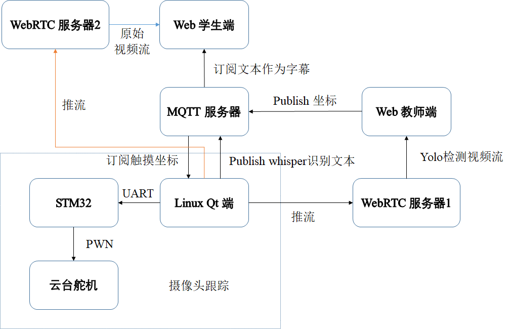
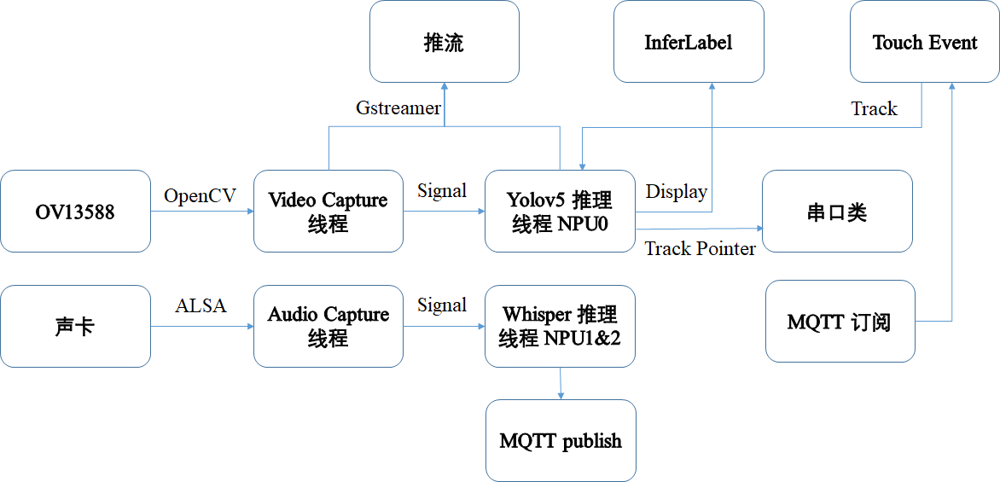

# 一、架构

## 1. 整体架构

## 2. Linux Qt 端架构

# 二、实现功能

## 1. Web 端

- 学生端：能够显示摄像头的视频，并显示字幕
  - 通过接收原始视频流
  - 通过订阅Whisper识别的文本作为字幕
- 教师端：能够显示YOLO检测视频流，且可以通过触摸检测框进行人体跟踪
  - 通过接收推流视频流
  - 通过发布坐标给 Linux 端，进行触摸事件的处理。

## 2. Linux Qt 端

- 在 UI 中显示推理视频
  - Video Capture 线程通过 OpenCV 获取摄像头视频
  - Video Capture 线程 传递帧就位信号给 Yolov5 推理线程
  - Yolov5 绑定 NPU0核心，传递推流完成信号给 InferLabel 进行显示
- 通过触摸检测框进行单目标跟踪
  - Qt 触摸事件，通过点击 InferLabel，传递坐标信号给 Touch Event
  - 另一方面，通过订阅 MQTT 的坐标，传递坐标给 Touch Event
  - Touch Event 将检测框的标志位改变，而 Yolov5 将改变的标志位检测框进行颜色改变
  - OpenCV 自带 Track，进行对目标检测框进行预测跟踪
  - 对追踪的检测框，通过视场角计算和中心的偏差，并通过串口传给 STM32

- 对语音进行识别
  - ALSA 捕获音频，传递信号给 Whisper推理线程。
  - MQTT 发布识别后的文本

## 3. STM32 端

- 控制云台舵机，始终保持目标在显示中央
  - 通过串口接收 Linux 端传递来的目标检测框的中心坐标偏差角
  - 计算每帧之间的坐标角度，换算为 PWM
  - 通过控制 PWM，进而控制云台舵机

